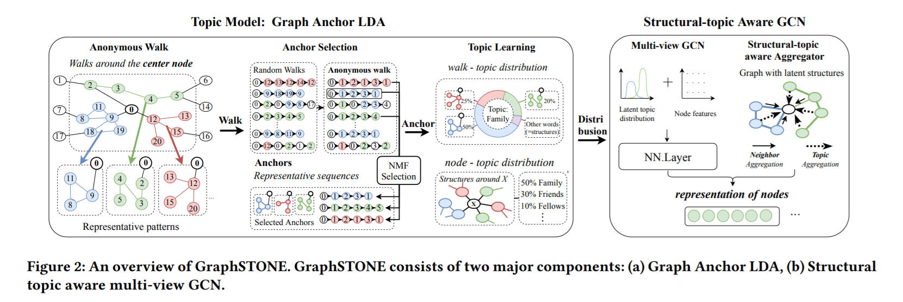

# [Graph Structural-topic Neural Network](https://arxiv.org/pdf/2006.14278.pdf)

GraphSTONE图结构主题神经网络

通常GCN的重点更多地放在节点特征上，而很少关注邻域内的图结构，尤其是高阶结构模式.

但是局部结构模式显示出在许多领域中节点特性的指示

利用图的主题模型的GCN模型，从而使结构性主题从概率方面广泛地捕获指示性图结构，而不仅仅是少数结构

把NLP上的主题模型用到Graph上, 这样就关注邻居的图形结构,尤其是更高阶的结构

使用匿名游走和Graph Anchor LDA在Graph上建立主题模型，Graph Anchor LDA首先选择重要的结构模式，以减轻复杂性并有效地生成结构主题,并设计了多视图GCN，以统一节点特征和结构主题特征，并利用结构主题指导聚合。

## Motivation

1. GCN的重点更多地放在节点特征上，而很少关注邻域内的图结构，尤其是高阶结构模式==>利用图的主题模型的GCN模型,工作重点在于结构上的分布，而不是个体上的分布结构

2. 以前的工作通常集中在预先定义的结构上，这些结构可能不够灵活，无法很好地概括具有不同性质的网络。==>匿名游走,**匿名游走**(描绘局部结构)是一种描绘结构模式的灵活而有效的度量标准仅涉及采样而不是匹配,使用主题模型的解决方案将更加高效，因为我们可以预先选择主题建模的锚点

3. 图的主题建模比NLP困难很多,怎样建模==>Graph Anchor LDA主题建模算法，预选“锚”，即具有代表性的结构模式

## Model

1. 为每个节点采样匿名随机游走以描绘节点的局部结构。
2. 然后在每个节点的匿名游走上执行Graph Anchor LDA，我们首先选择锚点，即通过非负矩阵分解进行指示性匿名游走序列。 获得游走主题和节点主题的分布之后，通过输出每个节点表示的多视图GCN将这些结构属性与原始节点特征结合起来。

**Anonymous Walks**: 类似染色法,把相同的节点匿名化为同一个节点

$B(v,r) $表示由${dist}(v, u) \leq r$ 的节点生成的诱导子图,$P_L$表示从v开始的长度为L的匿名随机游走序列,$B(v,r)$能用$(P_1,...,P_L)$重建,其中$L=2(m + 1)$,m是$B$中的边数**匿名游走以一般方式描述节点的局部结构的能力**

**Topic Modeling on Graphs**

给定一个图$G=(V,E)$,一组长度为$l$的可能的匿名游走序列为$W_l$,有$K$结构主题,图形上的主题模型
旨在学习**主题矩阵R和游走主题矩阵U**

**主题矩阵R**:$R \in \mathbb{R}^{|V| \times K}$,其中$R_{ik}$表示节点i属于第k个主题的概率,每一行是一个节点

**游走主题矩阵U**:$U \in \mathbb{R}^{K \times |W_l|}$其中$U_{kw}$表示$w \in W_l$属于第k个主题的概率                                                                                                                     

### Graph Anchor LDA

由于图中没有停用词的概念,怎样去掉无用且多的结构是一个难题===>选择高度指示性的结构"anchors"来继续进行进一步的主题建模。

**Walk-Walk Co-Occurrence Matrix(路径共现矩阵)**:$M \in \mathbb{R}^{|W_l| \times |W_l|}$,其中$M_{i, j}=\sum_{v_{k} \in V} \mathbb{I}\left(w_{i} \in D_{k}, w_{j} \in D_{k}\right)$**(只有i,j都在从k开始的游走序列中共现的次数)**

其中$D_i$表示从节点i开始的匿名游走序列,Di = N为要采样的步数

采用非负矩阵分解（NMF)提取锚点

$H, Z=\arg \min \|M-H Z\|_{F}^{2}$
s.t. $\quad H, Z^{T} \in \mathbb{R}^{\left|\mathcal{W}_{l}\right| \times \alpha}, H, Z \geq 0 .$

我们迭代更新H，Z直到收敛，然后通过$\mathrm{A}_{k}=\arg \max \left(Z_{k}\right), k=1, \ldots \alpha$来找到锚点。A是锚的索引集

直观地，通过选择权重最大的游走序列，但我们选择的是最有能力解释其他游走序列（即指示性游走序列）发生的游走序列。理论上表明，所选游走序列不仅指示游走序列共现，而且还指示了潜在的游走序列

根据选择的锚点，继续学习游走序列主题分布U,并通过

$\arg \min _{U} D_{K L}\left(Q_{i} \| \sum_{k \in \mathrm{A}} U_{i k} \operatorname{diag}^{-1}(Q \overrightarrow{1}) Q_{\mathrm{A}_{k}}\right)$

得到**游走主题矩阵U**,其中Q是带有锚点的以A为anchor 的重新排列路径共现矩阵,$Q_{\mathrm{A}_{k}}$是Q的第k个anchor的行

**Node-Walk Matrix**:$Y \in \mathbb{R}^{|V| \times\left|\mathcal{W}_{l}\right|}$其中$Y_{iw}$表示w在$D_i$中出现的次数

**节点主题分布R**;$R=Y U^{\dagger}$,其中$U^{\dagger}$表示伪逆

**Structural-topic Aware Aggregator**

利用学到的结构性主题来指导聚合

利用节点的重要性抽样方案根据其结构性主题的相似性，例如可以通过说明同构性的方式来聚合邻域，即类似的节点之间会互相影响更多

$h_{i}^{(k)}=$ AGGREGATE $\left(\left\{\frac{R_{i}^{T} R_{j}}{\sum_{j} R_{i}^{T} R_{j}} h_{j}^{(k-1)}, v_{j} \in N\left(v_{i}\right)\right\}\right)$

**Multi-view GCN**

引入两个平行的GCN,一个关注结构性的主题,一个关注节点对应的Feature

$h_{i}^{(L)}=\left(\mathbf{W} \cdot \tanh \left(\left[h_{i, n}^{(L)} \otimes h_{i, s}^{(L)}\right]\right)+\mathbf{b}\right)$

$h_{i,n} ^ {(L)}$表示第L层节点i的GCN输出,关注节点对应的Feature

$h_{i,s} ^ {(L)}$表示第L层节点i的GCN输出,关注结构性的主题

采用了GraphSAGE的无监督目标用于学习输出向量。

$\mathcal{L}=-\log \left[\sigma\left(h_{i}^{(L) T} h_{j}^{(L)}\right)\right]-q \cdot \mathbb{E}_{v_{n} \sim P_{n}(v)} \log \left[\sigma\left(h_{i}^{(L) T} h_{n}^{(L)}\right)\right]$

$v_i,v_j$在匿名游走序列中共现,$P_n(v)$是负采样的噪声分布

## 总结

把LDA用在了图上,根据motif的分类指导聚类,

